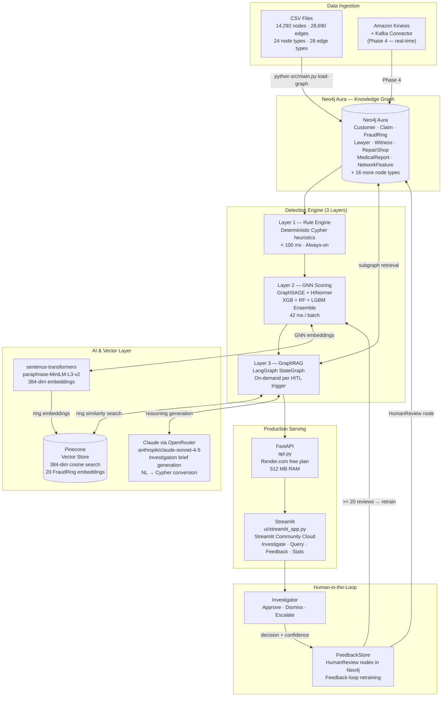

# System Architecture

```mermaid
flowchart TB
    subgraph Ingest["Data Ingestion"]
        CSV["CSV Files\n14,292 nodes · 28,690 edges\n24 node types · 28 edge types"]
        Kinesis["Amazon Kinesis\n+ Kafka Connector\n(Phase 4 — real-time)"]
    end

    subgraph GraphDB["Neo4j Aura — Knowledge Graph"]
        Neo4j[("Neo4j Aura\nCustomer · Claim · FraudRing\nLawyer · Witness · RepairShop\nMedicalReport · NetworkFeature\n+ 16 more node types")]
    end

    subgraph Detection["Detection Engine (3 Layers)"]
        L1["Layer 1 — Rule Engine\nDeterministic Cypher heuristics\n< 100 ms · Always-on"]
        L2["Layer 2 — GNN Scoring\nGraphSAGE + HINormer\nXGB + RF + LGBM Ensemble\n42 ms / batch"]
        L3["Layer 3 — GraphRAG\nLangGraph StateGraph\nOn-demand per HITL trigger"]
    end

    subgraph AI["AI & Vector Layer"]
        Embed["sentence-transformers\nparaphrase-MiniLM-L3-v2\n384-dim embeddings"]
        Pinecone[("Pinecone\nVector Store\n384-dim cosine search\n20 FraudRing embeddings")]
        Claude["Claude via OpenRouter\nanthropik/claude-sonnet-4-5\nInvestigation brief generation\nNL → Cypher conversion"]
    end

    subgraph Serving["Production Serving"]
        API["FastAPI\napi.py\nRender.com free plan\n512 MB RAM"]
        UI["Streamlit\nui/streamlit_app.py\nStreamlit Community Cloud\nInvestigate · Query · Feedback · Stats"]
    end

    subgraph HITL["Human-in-the-Loop"]
        Inv["Investigator\nApprove · Dismiss · Escalate"]
        Feedback["FeedbackStore\nHumanReview nodes in Neo4j\nFeedback-loop retraining"]
    end

    CSV -->|"python src/main.py load-graph"| Neo4j
    Kinesis -->|"Phase 4"| Neo4j
    Neo4j --> L1 --> L2 --> L3
    L2 <-->|"GNN embeddings"| Embed
    L3 <-->|"subgraph retrieval"| Neo4j
    L3 <-->|"ring similarity search"| Pinecone
    L3 <-->|"reasoning generation"| Claude
    Embed -->|"ring embeddings"| Pinecone
    L3 --> API
    API --> UI
    UI --> Inv
    Inv -->|"decision + confidence"| Feedback
    Feedback -->|"HumanReview node"| Neo4j
    Feedback -->|">= 20 reviews → retrain"| L2
```
