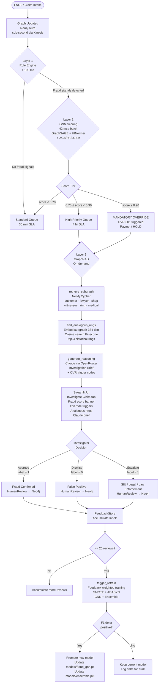

# Detection Pipeline Flowchart

End-to-end flow of a claim from intake through investigation decision.

```mermaid
flowchart TD
    A(["FNOL / Claim Intake"]) --> B["Graph Updated\nNeo4j Aura\nsub-second via Kinesis"]

    B --> C{"Layer 1\nRule Engine\n< 100 ms"}

    C -->|"No fraud signals"| STD["Standard Queue\n30 min SLA"]
    C -->|"Fraud signals detected"| D{"Layer 2\nGNN Scoring\n42 ms / batch\nGraphSAGE + HINormer\n+ XGB/RF/LGBM"}

    D --> TIER{"Score Tier"}

    TIER -->|"score < 0.70"| STD
    TIER -->|"0.70 ≤ score < 0.90"| HIGH["High Priority Queue\n4 hr SLA"]
    TIER -->|"score ≥ 0.90"| OVR["MANDATORY OVERRIDE\nOVR-001 triggered\nPayment HOLD"]

    HIGH --> L3{"Layer 3\nGraphRAG\nOn-demand"}
    OVR --> L3

    L3 --> SG["retrieve_subgraph\nNeo4j Cypher\ncustomer · lawyer · shop\nwitnesses · ring · medical"]
    SG --> AR["find_analogous_rings\nEmbed subgraph 384-dim\nCosine search Pinecone\ntop-3 historical rings"]
    AR --> BRIEF["generate_reasoning\nClaude via OpenRouter\nInvestigation Brief\n+ OVR trigger codes"]

    BRIEF --> UI["Streamlit UI\nInvestigate Claim tab\nFraud score banner\nOverride triggers\nAnalogous rings\nClaude brief"]

    UI --> INV{"Investigator\nDecision"}

    INV -->|"Approve\nlabel = 1"| CONF["Fraud Confirmed\nHumanReview → Neo4j"]
    INV -->|"Dismiss\nlabel = 0"| FP["False Positive\nHumanReview → Neo4j"]
    INV -->|"Escalate\nlabel = 1"| ESC["SIU / Legal / Law Enforcement\nHumanReview → Neo4j"]

    CONF & FP & ESC --> FB["FeedbackStore\nAccumulate labels"]

    FB --> THRESH{">= 20 reviews?"}
    THRESH -->|"No"| WAIT["Accumulate more reviews"]
    THRESH -->|"Yes"| RETRAIN["trigger_retrain\nFeedback-weighted training\nSMOTE + ADASYN\nGNN + Ensemble"]

    RETRAIN --> F1{"F1 delta\npositive?"}
    F1 -->|"Yes"| PROMOTE["Promote new model\nUpdate models/fraud_gnn.pt\nUpdate models/ensemble.pkl"]
    F1 -->|"No"| KEEP["Keep current model\nLog delta for audit"]
```
