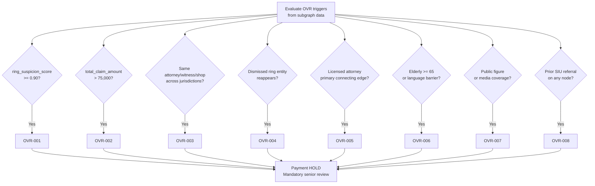

# GraphRAG Pipeline — LangGraph StateGraph

Internal flow of the `run_pipeline()` call in `src/agent/pipeline.py`.

```mermaid
flowchart LR
    INPUT(["Claim ID\ne.g. CLM-521585"]) --> STATE

    subgraph STATE["LangGraph State"]
        direction TB
        S1["claim_id: str"]
        S2["fraud_score: float"]
        S3["subgraph: dict"]
        S4["subgraph_text: str"]
        S5["analogous_rings: list"]
        S6["override_triggers: list[str]"]
        S7["reasoning_trace: str"]
        S8["error: str | None"]
    end

    STATE --> N1

    subgraph GRAPH["StateGraph — src/agent/pipeline.py"]
        direction LR

        N1["retrieve_subgraph\nNode 1"] --> N2["find_analogous_rings\nNode 2"] --> N3["generate_reasoning\nNode 3"]
    end

    subgraph NEO4J["Neo4j Aura"]
        direction TB
        Q1["MATCH Claim by claim_id\nfinal_suspicion_score\nadjuster_priority_tier"]
        Q2["MATCH Customer\n→ FILED_CLAIM"]
        Q3["MATCH Lawyer\n→ REPRESENTED_BY"]
        Q4["MATCH RepairShop\n→ REPAIRED_AT"]
        Q5["MATCH Witnesses\n→ HAS_WITNESS (limit 5)"]
        Q6["MATCH FraudRing\n→ RING_CONTAINS_CLAIM"]
        Q7["MATCH InvestigationCase\n→ INVESTIGATES_CLAIM"]
        Q8["MATCH NetworkFeature\n→ DESCRIBES_ENTITY"]
        Q9["MATCH SHARES_ATTRIBUTE\nedges on Customer"]
    end

    subgraph PINECONE["Pinecone Vector Store"]
        direction TB
        E1["FraudEmbedder\nsubgraph text → 384-dim vector"]
        E2["cosine similarity search\ntop-K = 3 rings"]
        E3["ring metadata\nstatus · ring_score\nmember_count · total_amount"]
    end

    subgraph OPENROUTER["OpenRouter — Claude"]
        direction TB
        P1["REASONING_SYSTEM_PROMPT\nOVR criteria OVR-001 to OVR-008\nGraph schema context"]
        P2["User message:\nsubgraph_text\nanalogous rings\nfraud score"]
        P3["Investigation Brief\n1. FRAUD SIGNALS DETECTED\n2. RING PATTERN ANALYSIS\n3. ANALOGOUS HISTORICAL CASES\n4. MANDATORY OVERRIDE STATUS\n5. RECOMMENDED ACTION"]
    end

    N1 <-->|"9 Cypher queries"| NEO4J
    N1 -->|"populate subgraph + subgraph_text"| N2
    N2 <-->|"embed + search"| PINECONE
    N2 -->|"populate analogous_rings\npopulate override_triggers"| N3
    N3 <-->|"chat.completions.create"| OPENROUTER
    N3 --> OUTPUT(["Pipeline Result\nfraud_score\noverride_triggers\nanalogous_rings\nreasoning_trace"])
```

## Override Trigger Evaluation (Node 2)

```mermaid
flowchart TD
    CHECK["Evaluate OVR triggers\nfrom subgraph data"] --> OVR1{"ring_suspicion_score\n>= 0.90?"}
    OVR1 -->|Yes| T1["OVR-001"]
    CHECK --> OVR2{"total_claim_amount\n> 75,000?"}
    OVR2 -->|Yes| T2["OVR-002"]
    CHECK --> OVR3{"Same attorney/witness/shop\nacross jurisdictions?"}
    OVR3 -->|Yes| T3["OVR-003"]
    CHECK --> OVR4{"Dismissed ring entity\nreappears?"}
    OVR4 -->|Yes| T4["OVR-004"]
    CHECK --> OVR5{"Licensed attorney\nprimary connecting edge?"}
    OVR5 -->|Yes| T5["OVR-005"]
    CHECK --> OVR6{"Elderly >= 65\nor language barrier?"}
    OVR6 -->|Yes| T6["OVR-006"]
    CHECK --> OVR7{"Public figure\nor media coverage?"}
    OVR7 -->|Yes| T7["OVR-007"]
    CHECK --> OVR8{"Prior SIU referral\non any node?"}
    OVR8 -->|Yes| T8["OVR-008"]
    T1 & T2 & T3 & T4 & T5 & T6 & T7 & T8 --> HOLD["Payment HOLD\nMandatory senior review"]
```
