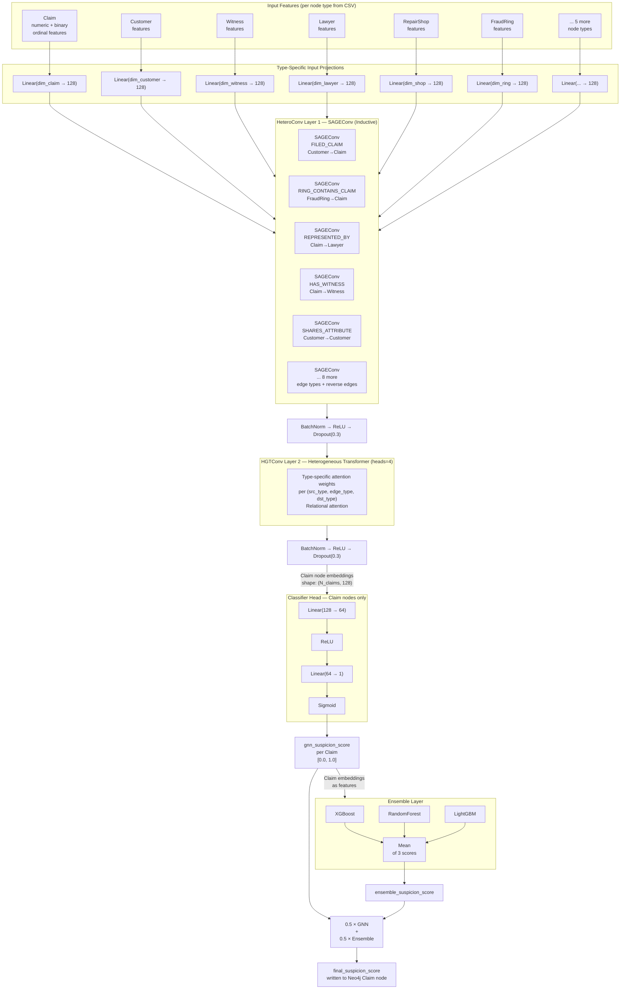
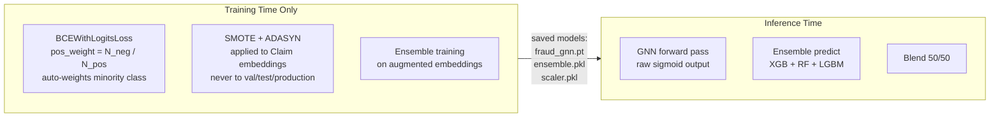
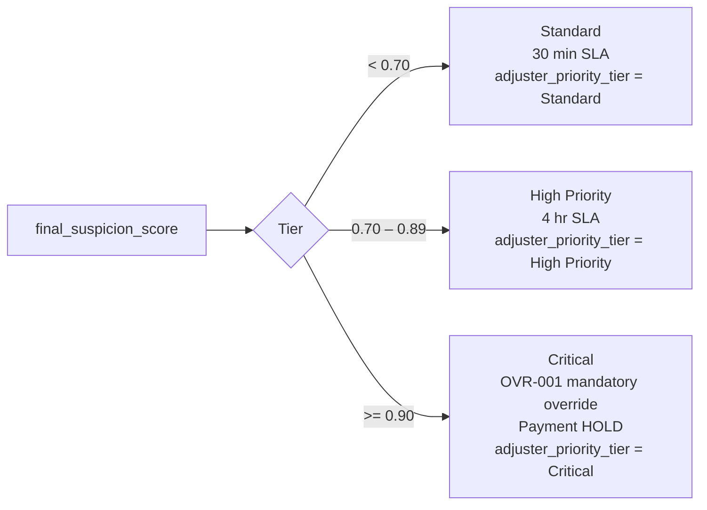

# GNN Model Architecture

Architecture of `FraudGNN` defined in `src/services/gnn/model.py`.

```mermaid
flowchart TD
    subgraph INPUT["Input Features (per node type from CSV)"]
        direction LR
        NC["Claim\nnumeric + binary\nordinal features"]
        NCU["Customer\nfeatures"]
        NW["Witness\nfeatures"]
        NL["Lawyer\nfeatures"]
        NS["RepairShop\nfeatures"]
        NR["FraudRing\nfeatures"]
        NO["... 5 more\nnode types"]
    end

    subgraph PROJ["Type-Specific Input Projections"]
        direction LR
        P1["Linear(dim_claim → 128)"]
        P2["Linear(dim_customer → 128)"]
        P3["Linear(dim_witness → 128)"]
        P4["Linear(dim_lawyer → 128)"]
        P5["Linear(dim_shop → 128)"]
        P6["Linear(dim_ring → 128)"]
        P7["Linear(... → 128)"]
    end

    NC --> P1
    NCU --> P2
    NW --> P3
    NL --> P4
    NS --> P5
    NR --> P6
    NO --> P7

    subgraph SAGE["HeteroConv Layer 1 — SAGEConv (Inductive)"]
        direction LR
        S1["SAGEConv\nFILED_CLAIM\nCustomer→Claim"]
        S2["SAGEConv\nRING_CONTAINS_CLAIM\nFraudRing→Claim"]
        S3["SAGEConv\nREPRESENTED_BY\nClaim→Lawyer"]
        S4["SAGEConv\nHAS_WITNESS\nClaim→Witness"]
        S5["SAGEConv\nSHARES_ATTRIBUTE\nCustomer→Customer"]
        S6["SAGEConv\n... 8 more\nedge types + reverse edges"]
    end

    P1 & P2 & P3 & P4 & P5 & P6 & P7 --> SAGE

    BN1["BatchNorm → ReLU → Dropout(0.3)"]
    SAGE --> BN1

    subgraph HGT["HGTConv Layer 2 — Heterogeneous Transformer (heads=4)"]
        direction LR
        H1["Type-specific attention weights\nper (src_type, edge_type, dst_type)\nRelational attention"]
    end

    BN1 --> HGT

    BN2["BatchNorm → ReLU → Dropout(0.3)"]
    HGT --> BN2

    subgraph HEAD["Classifier Head — Claim nodes only"]
        direction LR
        FC1["Linear(128 → 64)"]
        RELU["ReLU"]
        FC2["Linear(64 → 1)"]
        SIG["Sigmoid"]
    end

    BN2 -->|"Claim node embeddings\nshape: (N_claims, 128)"| HEAD
    FC1 --> RELU --> FC2 --> SIG

    SIG --> OUT["gnn_suspicion_score\nper Claim\n[0.0, 1.0]"]

    subgraph ENSEMBLE["Ensemble Layer"]
        direction LR
        XGB["XGBoost"]
        RF["RandomForest"]
        LGBM["LightGBM"]
        AVG["Mean\nof 3 scores"]
    end

    OUT -->|"Claim embeddings\nas features"| ENSEMBLE
    XGB & RF & LGBM --> AVG

    AVG --> ESC["ensemble_suspicion_score"]
    OUT --> BLEND["0.5 × GNN\n+\n0.5 × Ensemble"]
    ESC --> BLEND
    BLEND --> FINAL["final_suspicion_score\nwritten to Neo4j Claim node"]
```

## Class Imbalance Strategy

```mermaid
flowchart LR
    subgraph TRAIN["Training Time Only"]
        T1["BCEWithLogitsLoss\npos_weight = N_neg / N_pos\nauto-weights minority class"]
        T2["SMOTE + ADASYN\napplied to Claim embeddings\nnever to val/test/production"]
        T3["Ensemble training\non augmented embeddings"]
    end

    subgraph INFER["Inference Time"]
        I1["GNN forward pass\nraw sigmoid output"]
        I2["Ensemble predict\nXGB + RF + LGBM"]
        I3["Blend 50/50"]
    end

    TRAIN -->|"saved models:\nfraud_gnn.pt\nensemble.pkl\nscaler.pkl"| INFER
```

## Score Tier Routing

```mermaid
flowchart LR
    SCORE["final_suspicion_score"] --> T{Tier}
    T -->|"< 0.70"| STD["Standard\n30 min SLA\nadjuster_priority_tier = Standard"]
    T -->|"0.70 – 0.89"| HIGH["High Priority\n4 hr SLA\nadjuster_priority_tier = High Priority"]
    T -->|">= 0.90"| CRIT["Critical\nOVR-001 mandatory override\nPayment HOLD\nadjuster_priority_tier = Critical"]
```
