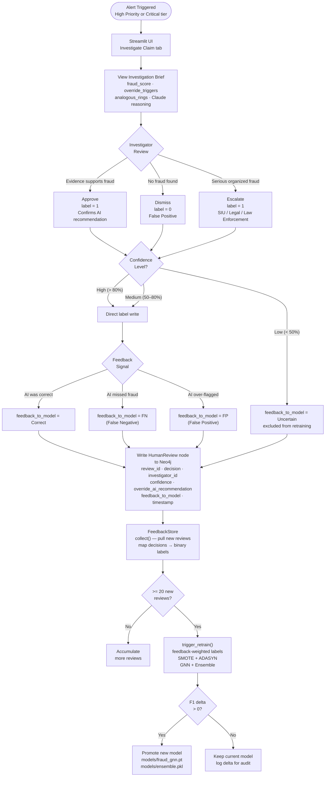
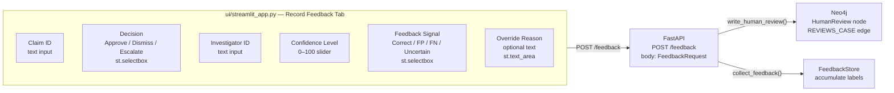
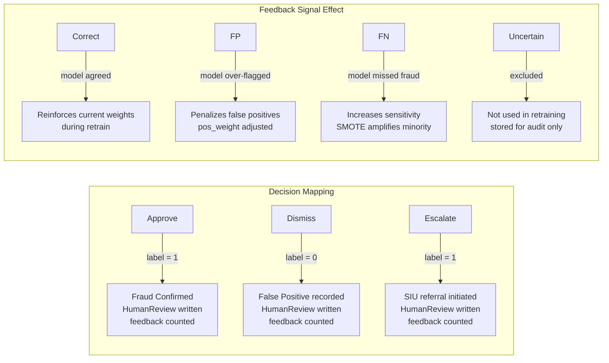

# HITL Decision Flow

Human-in-the-Loop investigator workflow from claim review to model feedback.

```mermaid
flowchart TD
    ALERT(["Alert Triggered\nHigh Priority or Critical tier"]) --> UI["Streamlit UI\nInvestigate Claim tab"]

    UI --> BRIEF["View Investigation Brief\nfraud_score · override_triggers\nanalogous_rings · Claude reasoning"]

    BRIEF --> REVIEW{"Investigator\nReview"}

    REVIEW -->|"Evidence supports fraud"| APP["Approve\nlabel = 1\nConfirms AI recommendation"]
    REVIEW -->|"No fraud found"| DIS["Dismiss\nlabel = 0\nFalse Positive"]
    REVIEW -->|"Serious organized fraud"| ESC["Escalate\nlabel = 1\nSIU / Legal / Law Enforcement"]

    APP --> CONF_VAL{"Confidence\nLevel?"}
    DIS --> CONF_VAL
    ESC --> CONF_VAL

    CONF_VAL -->|"High (> 80%)"| DIRECT["Direct label write"]
    CONF_VAL -->|"Medium (50–80%)"| DIRECT
    CONF_VAL -->|"Low (< 50%)"| UNC["feedback_to_model = Uncertain\nexcluded from retraining"]

    DIRECT --> FB_SIG{"Feedback\nSignal"}
    FB_SIG -->|"AI was correct"| CORR["feedback_to_model = Correct"]
    FB_SIG -->|"AI missed fraud"| FN["feedback_to_model = FN\n(False Negative)"]
    FB_SIG -->|"AI over-flagged"| FP["feedback_to_model = FP\n(False Positive)"]

    CORR & FN & FP & UNC --> HRN["Write HumanReview node\nto Neo4j\nreview_id · decision · investigator_id\nconfidence · override_ai_recommendation\nfeedback_to_model · timestamp"]

    HRN --> FS["FeedbackStore\ncollect() — pull new reviews\nmap decisions → binary labels"]

    FS --> COUNT{">= 20 new\nreviews?"}
    COUNT -->|"No"| WAIT["Accumulate\nmore reviews"]
    COUNT -->|"Yes"| RETRAIN["trigger_retrain()\nfeedback-weighted labels\nSMOTE + ADASYN\nGNN + Ensemble"]

    RETRAIN --> F1{"F1 delta\n> 0?"}
    F1 -->|"Yes"| PROMOTE["Promote new model\nmodels/fraud_gnn.pt\nmodels/ensemble.pkl"]
    F1 -->|"No"| KEEP["Keep current model\nlog delta for audit"]
```

## Investigator Feedback Form Fields

```mermaid
flowchart LR
    subgraph FORM["ui/streamlit_app.py — Record Feedback Tab"]
        direction TB
        F1["Claim ID\ntext input"]
        F2["Decision\nApprove / Dismiss / Escalate\nst.selectbox"]
        F3["Investigator ID\ntext input"]
        F4["Confidence Level\n0–100 slider"]
        F5["Feedback Signal\nCorrect / FP / FN / Uncertain\nst.selectbox"]
        F6["Override Reason\noptional text\nst.text_area"]
    end

    FORM -->|"POST /feedback"| API["FastAPI\nPOST /feedback\nbody: FeedbackRequest"]
    API -->|"write_human_review()"| NEO["Neo4j\nHumanReview node\nREVIEWS_CASE edge"]
    API -->|"collect_feedback()"| FS["FeedbackStore\naccumulate labels"]
```

## Decision → Label → Action Matrix

```mermaid
flowchart LR
    subgraph MATRIX["Decision Mapping"]
        direction TB
        D1["Approve"] -->|"label = 1"| A1["Fraud Confirmed\nHumanReview written\nfeedback counted"]
        D2["Dismiss"] -->|"label = 0"| A2["False Positive recorded\nHumanReview written\nfeedback counted"]
        D3["Escalate"] -->|"label = 1"| A3["SIU referral initiated\nHumanReview written\nfeedback counted"]
    end

    subgraph SIGNAL["Feedback Signal Effect"]
        direction TB
        S1["Correct"] -->|"model agreed"| E1["Reinforces current weights\nduring retrain"]
        S2["FP"] -->|"model over-flagged"| E2["Penalizes false positives\npos_weight adjusted"]
        S3["FN"] -->|"model missed fraud"| E3["Increases sensitivity\nSMOTE amplifies minority"]
        S4["Uncertain"] -->|"excluded"| E4["Not used in retraining\nstored for audit only"]
    end
```
