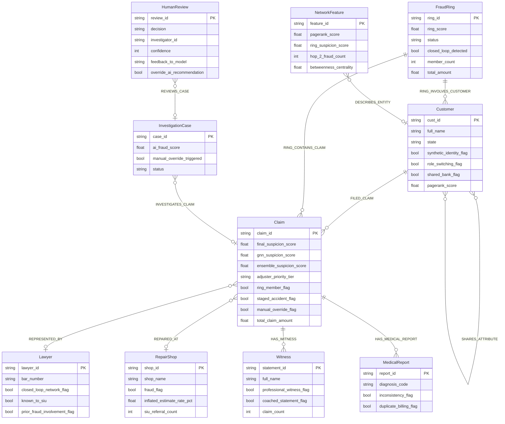
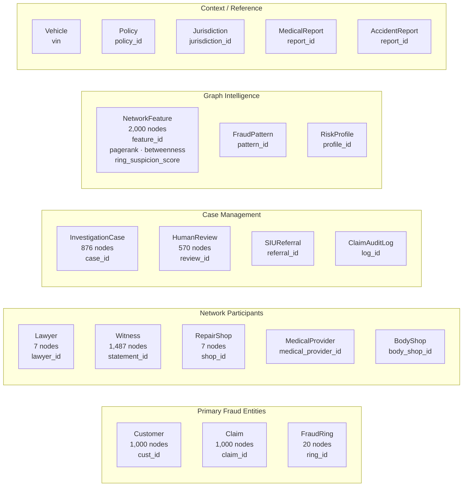
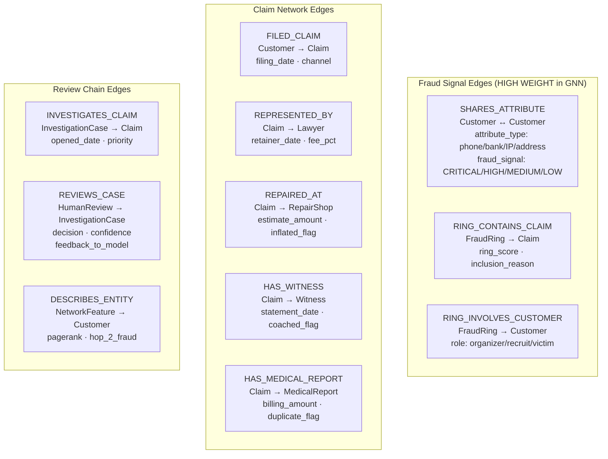

# Neo4j Graph Data Model

Knowledge graph schema: 24 node types · 28 edge types · 14,292 nodes · 28,690 edges · 941 properties.

## Core Entity Relationships



## Node Type Inventory



## Critical Edge Types



## SHARES_ATTRIBUTE Fraud Signal Detail

```mermaid
flowchart LR
    C1["Customer A"] -->|"SHARES_ATTRIBUTE\nattribute_type: bank_account\nfraud_signal: CRITICAL\nshared_value_hash: abc123"| C2["Customer B"]
    C2 -->|"SHARES_ATTRIBUTE\nattribute_type: phone\nfraud_signal: HIGH"| C3["Customer C"]
    C1 -->|"SHARES_ATTRIBUTE\nattribute_type: ip_address\nfraud_signal: MEDIUM"| C4["Customer D"]

    C1 -->|"FILED_CLAIM"| CL1["Claim 1\nfinal_suspicion_score: 0.94"]
    C2 -->|"FILED_CLAIM"| CL2["Claim 2\nfinal_suspicion_score: 0.91"]
    C3 -->|"FILED_CLAIM"| CL3["Claim 3\nfinal_suspicion_score: 0.88"]

    FR["FraudRing\nring_score: 0.95\nstatus: Active"] -->|"RING_CONTAINS_CLAIM"| CL1
    FR -->|"RING_CONTAINS_CLAIM"| CL2
    FR -->|"RING_CONTAINS_CLAIM"| CL3
    FR -->|"RING_INVOLVES_CUSTOMER"| C1
    FR -->|"RING_INVOLVES_CUSTOMER"| C2
    FR -->|"RING_INVOLVES_CUSTOMER"| C3

    CL1 & CL2 & CL3 -->|"REPRESENTED_BY"| LW["Lawyer\nknown_to_siu: true\nprior_fraud_involvement: true"]
    CL1 & CL2 & CL3 -->|"REPAIRED_AT"| RS["RepairShop\nfraud_flag: true\nsiu_referral_count: 8"]
