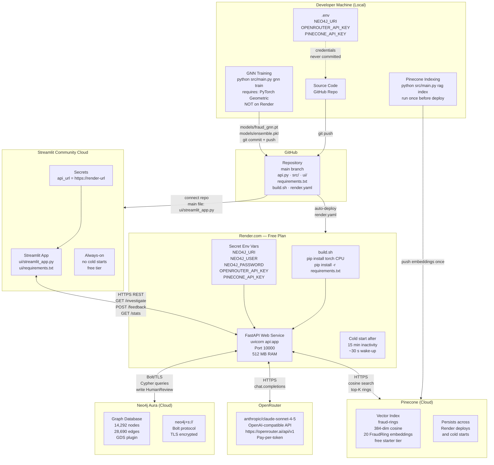
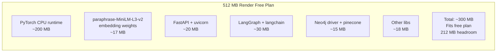
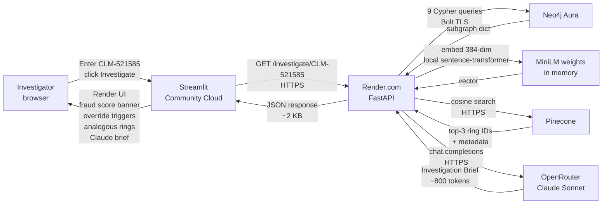

# Deployment Architecture

Production topology across cloud services.



## RAM Budget — Render Free Plan (512 MB)



## Request Flow — Investigate Claim



## Deployment Checklist

```mermaid
flowchart TD
    START(["Deploy"]) --> S1["1. Train GNN locally\npython src/main.py gnn train"]
    S1 --> S2["2. Score claims\npython src/main.py gnn score"]
    S2 --> S3["3. Create Pinecone index\nfraud-rings · 384-dim · cosine"]
    S3 --> S4["4. Index FraudRings\npython src/main.py rag index"]
    S4 --> S5["5. Commit model weights\nmodels/fraud_gnn.pt\nmodels/ensemble.pkl"]
    S5 --> S6["6. Push to GitHub\ngit push origin main"]
    S6 --> S7["7. Render auto-deploys\nrender.yaml picks up changes"]
    S7 --> S8["8. Set Render secrets\nNEO4J_URI · NEO4J_USER\nNEO4J_PASSWORD\nOPENROUTER_API_KEY\nPINECONE_API_KEY"]
    S8 --> S9["9. Verify API health\nGET /health → 200 OK"]
    S9 --> S10["10. Deploy Streamlit UI\nshare.streamlit.io\nMain file: ui/streamlit_app.py\nRequirements: ui/requirements.txt"]
    S10 --> S11["11. Set Streamlit secret\napi_url = https://your.onrender.com"]
    S11 --> DONE(["System Live"])
