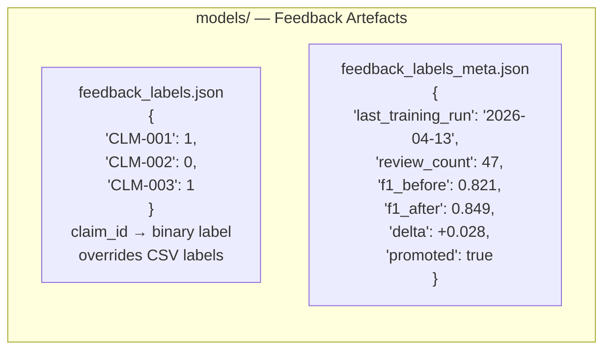
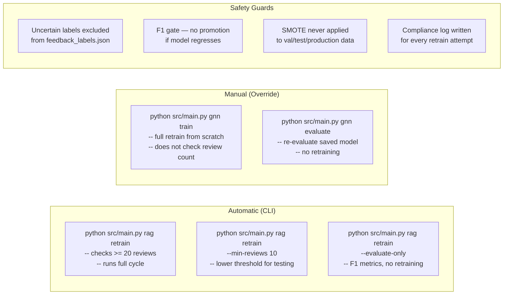

# Feedback & Retraining Loop

Continuous learning cycle from investigator decisions to model promotion.

```mermaid
flowchart TD
    INV["Investigator Decision\nApprove · Dismiss · Escalate\nconfidence · feedback_signal"]

    INV --> HR["HumanReview Node\nwritten to Neo4j\nreview_id · claim_id · investigator_id\ndecision · confidence\nfeedback_to_model: Correct/FP/FN/Uncertain\noverride_ai_recommendation: bool\ntimestamp"]

    HR --> FS["FeedbackStore.collect()\nsrc/services/feedback.py\npull HumanReview nodes\nsince last_training_run"]

    FS --> LABEL["Map decisions → binary labels\nApprove  → label = 1\nEscalate → label = 1\nDismiss  → label = 0\nUncertain → excluded"]

    LABEL --> COUNT{">= min_reviews\n(default 20)?"}

    COUNT -->|"No"| WAIT["Accumulate\nmore reviews\nlog count"]

    COUNT -->|"Yes"| F1DELTA["compute_f1_delta()\ncompare model predictions\nvs investigator ground truth\nF1 before / F1 after estimate"]

    F1DELTA --> TRIGGER["trigger_retrain()\nsrc/services/feedback.py\nsave feedback_labels.json\nsave feedback_labels_meta.json"]

    TRIGGER --> LOAD["Reload CSVs\nsrc/services/gnn/data_loader.py\napply feedback label overrides\nfeedback_labels.json\ntakes priority over CSV labels"]

    LOAD --> SMOTE["SMOTE + ADASYN\nsrc/services/gnn/train.py\napply_smote_adasyn()\ntraining split ONLY\nnever val / test / inference"]

    SMOTE --> TRAIN["run_training()\nBCEWithLogitsLoss\npos_weight = N_neg / N_pos\nSAGEConv + HGTConv\n+ XGB + RF + LGBM ensemble"]

    TRAIN --> EVAL["evaluate_model()\nF1 · AUC-ROC · Precision · Recall\non held-out val + test splits"]

    EVAL --> DELTA{"F1 delta\n> 0?"}

    DELTA -->|"Yes — improved"| PROMOTE["Promote new model\noverwrite models/fraud_gnn.pt\noverwrite models/ensemble.pkl\noverwrite models/scaler.pkl\nlog promotion event"]

    DELTA -->|"No — regression"| KEEP["Keep current model\nlog delta for audit\nalert compliance officer"]

    PROMOTE --> RESCORE["Re-score all Claims\npython src/main.py gnn score\nupdate Neo4j properties\ngnn_suspicion_score\nensemble_suspicion_score\nfinal_suspicion_score\nadjuster_priority_tier"]

    RESCORE --> LOOP(["Next cycle begins\nmonitor new reviews"])
```



## Feedback Label File Format



## Retraining Triggers



## F1 History — Stats Tab

```mermaid
flowchart LR
    subgraph STATS["Streamlit Stats Tab"]
        direction TB
        ST1["Total Reviews: 47"]
        ST2["Pending Retraining: 7\n(since last run)"]
        ST3["Vector Store Size: 20 rings"]
        ST4["F1 History Table\n| Date       | F1 Before | F1 After | Delta | Promoted |\n|------------|-----------|----------|-------|----------|\n| 2026-04-13 | 0.821     | 0.849    | +0.028 | Yes     |\n| 2026-03-28 | 0.798     | 0.821    | +0.023 | Yes     |"]
    end

    STATS -->|"GET /stats"| API["FastAPI\n/stats endpoint\nreads feedback_labels_meta.json\n+ Neo4j review count\n+ Pinecone vector count"]
