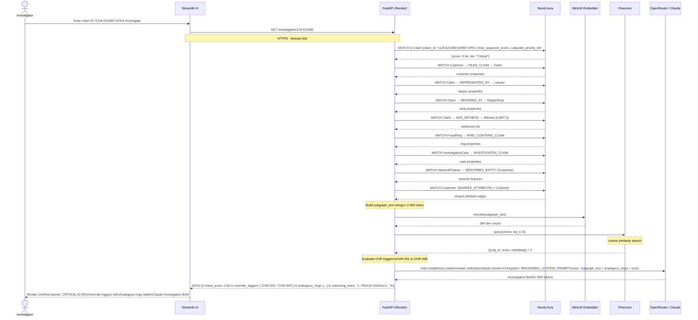
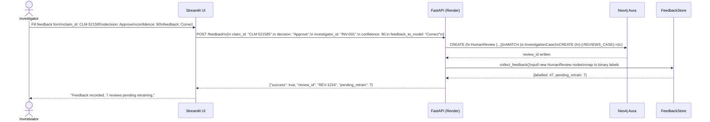
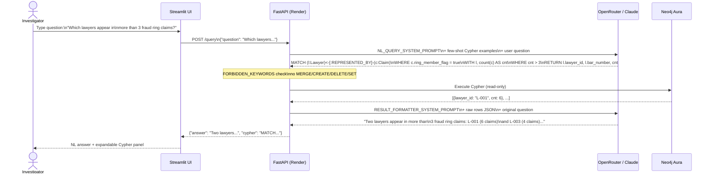
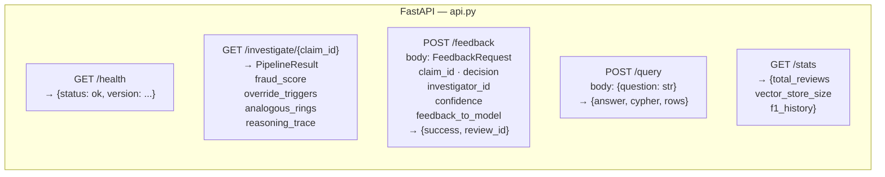

# API Sequence Diagrams

Interaction sequences between Streamlit UI, FastAPI, and backend services.

## Investigate Claim — Full Sequence

## Record Feedback — Sequence

## NL Graph Query — Sequence

## REST API Endpoints

