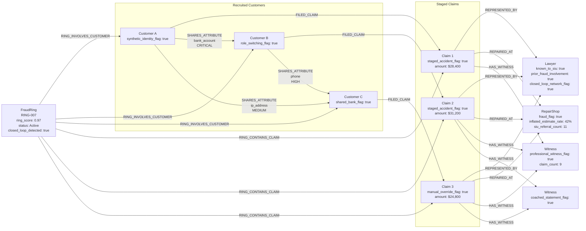
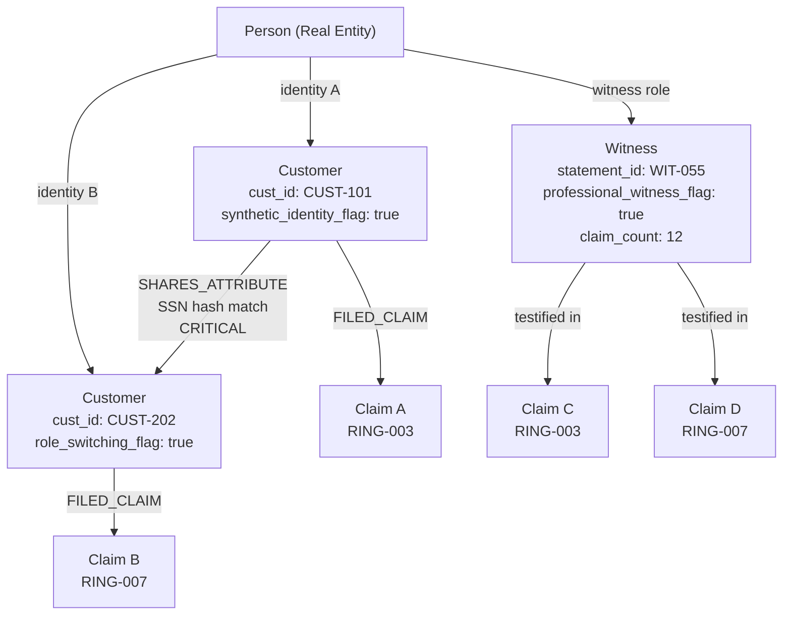
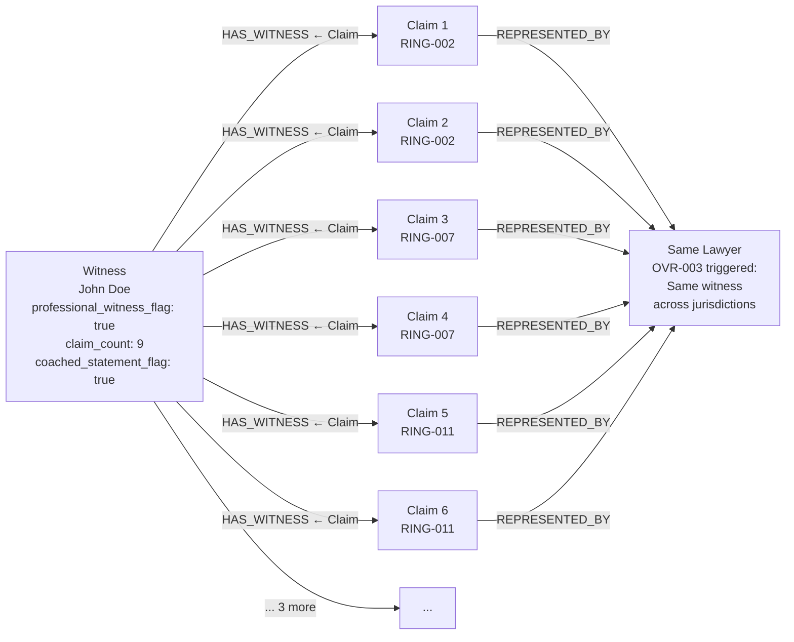
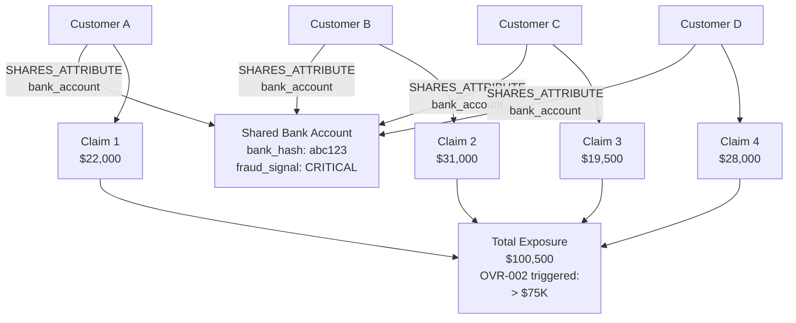
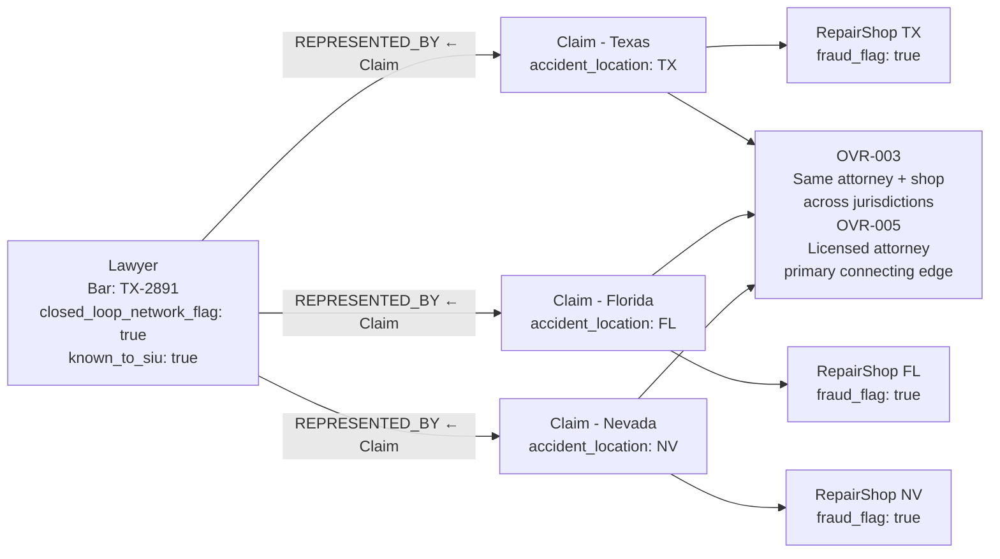
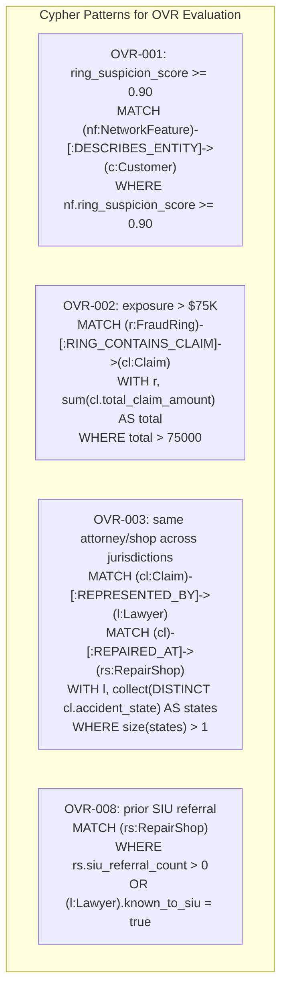

# Fraud Ring Patterns

Graph patterns that indicate organized insurance fraud.

## Pattern 1 — Closed-Loop Ring (Highest Severity)

All fraud actors are interconnected: shared lawyer, shared repair shop, shared witnesses, shared bank accounts.

## Pattern 2 — Role Switching (Identity Fraud)

Same individual appears as Customer, Witness, and claimant across multiple rings.

## Pattern 3 — Professional Witness Network

Single witness appearing across 5+ claims is a high-confidence fraud signal.

## Pattern 4 — Shared Bank Account (Financial Nexus)

Multiple customers share a single bank account — strong indicator of synthetic identities coordinated by a ring organizer.

## Pattern 5 — Cross-Jurisdiction Attorney

Licensed attorney filing claims across state lines triggers OVR-003.

## OVR Trigger Cypher — Common Detection Queries

