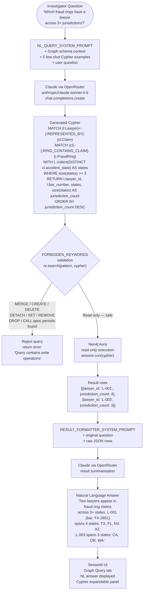
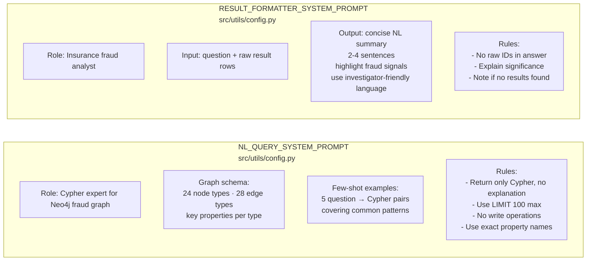
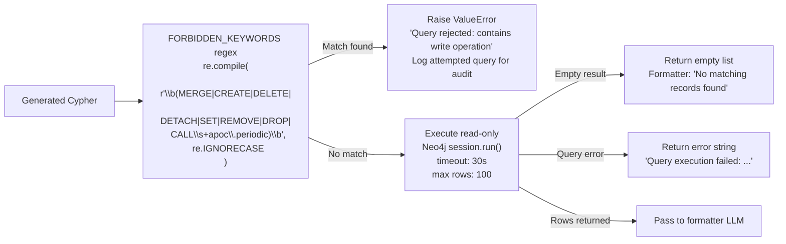
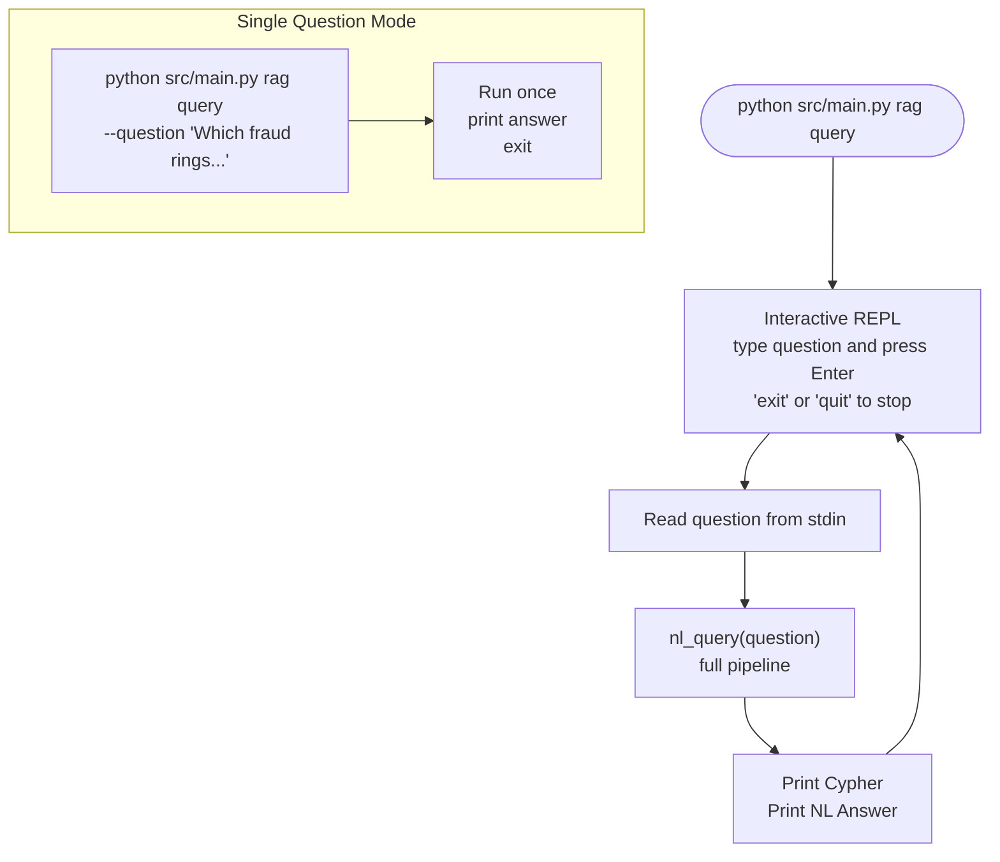
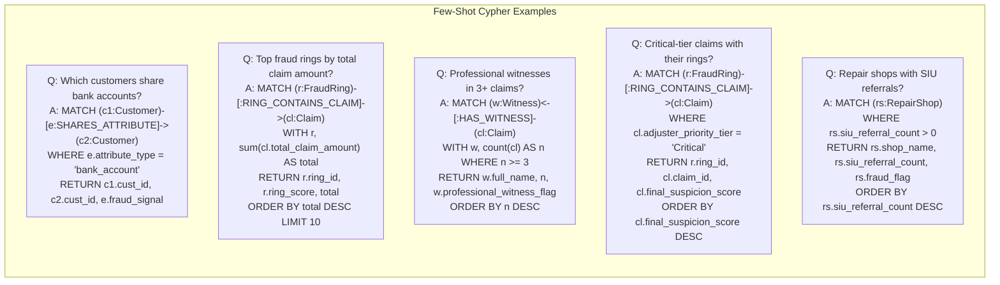

# NL Query Engine

Natural language to Cypher pipeline in `src/tools/nl_query.py`.

```mermaid
flowchart TD
    Q(["Investigator Question\n'Which fraud rings have a lawyer\nacross 3+ jurisdictions?'"])

    Q --> NL_PROMPT["NL_QUERY_SYSTEM_PROMPT\n+ Graph schema context\n+ 5 few-shot Cypher examples\n+ user question"]

    NL_PROMPT --> LLM1["Claude via OpenRouter\nanthropic/claude-sonnet-4-5\nchat.completions.create"]

    LLM1 --> CYPHER["Generated Cypher\nMATCH (l:Lawyer)<-[:REPRESENTED_BY]-(cl:Claim)\nMATCH (cl)-[:RING_CONTAINS_CLAIM]-(r:FraudRing)\nWITH l, collect(DISTINCT cl.accident_state) AS states\nWHERE size(states) >= 3\nRETURN l.lawyer_id, l.bar_number, states, size(states) AS jurisdiction_count\nORDER BY jurisdiction_count DESC"]

    CYPHER --> SAFETY{"FORBIDDEN_KEYWORDS\nvalidation\nre.search(pattern, cypher)"}

    SAFETY -->|"MERGE / CREATE / DELETE\nDETACH / SET / REMOVE\nDROP / CALL apoc.periodic\nfound"| REJECT["Reject query\nreturn error:\n'Query contains write operations'"]

    SAFETY -->|"Read-only — safe"| NEO["Neo4j Aura\nread-only execution\nsession.run(cypher)"]

    NEO --> ROWS["Result rows\n[{lawyer_id: 'L-001', jurisdiction_count: 4},\n {lawyer_id: 'L-003', jurisdiction_count: 3}]"]

    ROWS --> FMT_PROMPT["RESULT_FORMATTER_SYSTEM_PROMPT\n+ original question\n+ raw JSON rows"]

    FMT_PROMPT --> LLM2["Claude via OpenRouter\nresult summarisation"]

    LLM2 --> ANSWER["Natural Language Answer\n'Two lawyers appear in fraud ring claims\nacross 3+ states. L-001 (bar: TX-2891)\nspans 4 states: TX, FL, NV, AZ.\nL-003 spans 3 states: CA, OR, WA.'"]

    ANSWER --> UI["Streamlit UI\nGraph Query tab\nNL answer displayed\nCypher expandable panel"]
```

## Prompt Architecture

```mermaid
flowchart LR
    subgraph NL_SYS["NL_QUERY_SYSTEM_PROMPT\nsrc/utils/config.py"]
        direction TB
        NS1["Role: Cypher expert for Neo4j fraud graph"]
        NS2["Graph schema:\n24 node types · 28 edge types\nkey properties per type"]
        NS3["Few-shot examples:\n5 question → Cypher pairs\ncovering common patterns"]
        NS4["Rules:\n- Return only Cypher, no explanation\n- Use LIMIT 100 max\n- No write operations\n- Use exact property names"]
    end

    subgraph FMT_SYS["RESULT_FORMATTER_SYSTEM_PROMPT\nsrc/utils/config.py"]
        direction TB
        FS1["Role: Insurance fraud analyst"]
        FS2["Input: question + raw result rows"]
        FS3["Output: concise NL summary\n2-4 sentences\nhighlight fraud signals\nuse investigator-friendly language"]
        FS4["Rules:\n- No raw IDs in answer\n- Explain significance\n- Note if no results found"]
    end
```

## Safety Validation

```mermaid
flowchart LR
    CYPHER["Generated Cypher"] --> RE["FORBIDDEN_KEYWORDS regex\nre.compile(\n  r'\\b(MERGE|CREATE|DELETE|\n  DETACH|SET|REMOVE|DROP|\n  CALL\\s+apoc\\.periodic)\\b',\n  re.IGNORECASE\n)"]

    RE -->|"Match found"| ERR["Raise ValueError\n'Query rejected: contains write operation'\nLog attempted query for audit"]

    RE -->|"No match"| EXEC["Execute read-only\nNeo4j session.run()\ntimeout: 30s\nmax rows: 100"]

    EXEC -->|"Empty result"| EMPTY["Return empty list\nFormatter: 'No matching records found'"]
    EXEC -->|"Query error"| QERR["Return error string\n'Query execution failed: ...'"]
    EXEC -->|"Rows returned"| OK["Pass to formatter LLM"]
```

## Interactive REPL Mode

```mermaid
flowchart TD
    START(["python src/main.py rag query"]) --> REPL["Interactive REPL\ntype question and press Enter\n'exit' or 'quit' to stop"]
    REPL --> INPUT["Read question from stdin"]
    INPUT --> PIPE["nl_query(question)\nfull pipeline"]
    PIPE --> DISPLAY["Print Cypher\nPrint NL Answer"]
    DISPLAY --> REPL

    subgraph SINGLE["Single Question Mode"]
        S1["python src/main.py rag query\n--question 'Which fraud rings...'"]
        S1 --> S2["Run once\nprint answer\nexit"]
    end
```

## Few-Shot Examples in Prompt

```mermaid
flowchart LR
    subgraph EXAMPLES["Few-Shot Cypher Examples"]
        direction TB
        EX1["Q: Which customers share bank accounts?\nA: MATCH (c1:Customer)-[e:SHARES_ATTRIBUTE]->(c2:Customer)\nWHERE e.attribute_type = 'bank_account'\nRETURN c1.cust_id, c2.cust_id, e.fraud_signal"]

        EX2["Q: Top fraud rings by total claim amount?\nA: MATCH (r:FraudRing)-[:RING_CONTAINS_CLAIM]->(cl:Claim)\nWITH r, sum(cl.total_claim_amount) AS total\nRETURN r.ring_id, r.ring_score, total\nORDER BY total DESC LIMIT 10"]

        EX3["Q: Professional witnesses in 3+ claims?\nA: MATCH (w:Witness)<-[:HAS_WITNESS]-(cl:Claim)\nWITH w, count(cl) AS n WHERE n >= 3\nRETURN w.full_name, n, w.professional_witness_flag\nORDER BY n DESC"]

        EX4["Q: Critical-tier claims with their rings?\nA: MATCH (r:FraudRing)-[:RING_CONTAINS_CLAIM]->(cl:Claim)\nWHERE cl.adjuster_priority_tier = 'Critical'\nRETURN r.ring_id, cl.claim_id, cl.final_suspicion_score\nORDER BY cl.final_suspicion_score DESC"]

        EX5["Q: Repair shops with SIU referrals?\nA: MATCH (rs:RepairShop)\nWHERE rs.siu_referral_count > 0\nRETURN rs.shop_name, rs.siu_referral_count, rs.fraud_flag\nORDER BY rs.siu_referral_count DESC"]
    end
```
