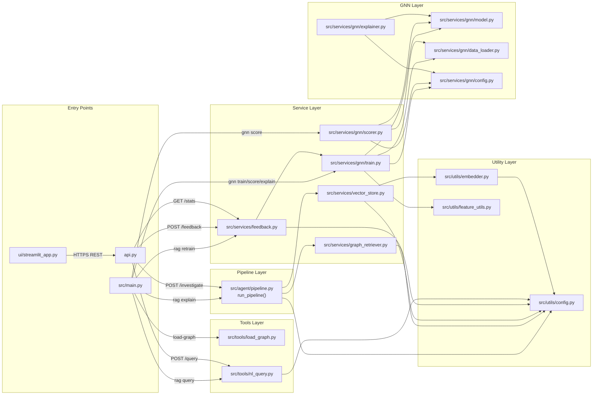

# Repository Structure & Module Dependencies

Package layout and import dependency graph.

## Directory Tree

```mermaid
flowchart TD
    ROOT["FraudRingDetectionGraph-RAGSystem/"]

    ROOT --> SRC["src/\nall backend source code"]
    ROOT --> UI["ui/\nStreamlit frontend"]
    ROOT --> DATA["data/\nCSV node + edge files"]
    ROOT --> MODELS["models/\ngit-ignored artefacts"]
    ROOT --> DIAG["diagrams/\nMermaid architecture docs"]
    ROOT --> CFG["Config Files\napi.py · build.sh\nrender.yaml · .env\nrequirements*.txt"]

    SRC --> MAIN["main.py\nUnified CLI entry point\nargparse subcommands:\nload-graph · gnn · rag"]

    SRC --> AGENT["agent/"]
    AGENT --> PIPELINE["pipeline.py\nLangGraph StateGraph\nrun_pipeline(claim_id)"]

    SRC --> SERVICES["services/"]
    SERVICES --> GR["graph_retriever.py\nNeo4j subgraph queries\nwrite_human_review()"]
    SERVICES --> VS["vector_store.py\nLocalVectorStore\nPineconeVectorStore"]
    SERVICES --> FB["feedback.py\nFeedbackStore\ntrigger_retrain()"]
    SERVICES --> GNN["gnn/"]

    GNN --> GC["config.py\nnode/edge types\nfeature columns\nhyperparams"]
    GNN --> DL["data_loader.py\nCSV → PyG HeteroData\ntrain/val/test splits"]
    GNN --> GM["model.py\nFraudGNN\nSAGEConv + HGTConv\nclassifier head"]
    GNN --> GT["train.py\ntraining loop\nSMOTE + ADASYN\nensemble training"]
    GNN --> GE["explainer.py\ngradient saliency\nreasoning traces"]
    GNN --> GS["scorer.py\nbatch inference\nNeo4j score write-back"]

    SRC --> TOOLS["tools/"]
    TOOLS --> LG["load_graph.py\nNeo4j bulk loader\n_build_parser() + main()"]
    TOOLS --> NQ["nl_query.py\nNL → Cypher → NL\nFORBIDDEN_KEYWORDS check"]

    SRC --> UTILS["utils/"]
    UTILS --> UC["config.py\nAPI keys · model names\nprompts · embedding config\nload_dotenv()"]
    UTILS --> UE["embedder.py\nFraudEmbedder\nsentence-transformers\n384-dim"]
    UTILS --> UF["feature_utils.py\nnumeric/binary/ordinal\nfeature extraction for GNN"]

    UI --> APP["streamlit_app.py\n4-tab investigator UI\nInvestigate · Query\nFeedback · Stats"]
    UI --> UR["requirements.txt\nstreamlit · requests\npandas"]
    UI --> STLIT[".streamlit/"]
    STLIT --> CT["config.toml\ndark theme"]
    STLIT --> SE["secrets.toml.example\napi_url template"]
```



## Module Import Dependencies



## Data Flow by Phase

```mermaid
flowchart LR
    subgraph PHASE1["Phase 1 — Graph Load"]
        P1_IN["data/*.csv\n24 node files\n28 edge files"]
        P1_TOOL["load_graph.py\nbulk loader"]
        P1_OUT[("Neo4j Aura\n14,292 nodes\n28,690 edges")]
        P1_IN --> P1_TOOL --> P1_OUT
    end

    subgraph PHASE2["Phase 2 — GNN Scoring"]
        P2_IN["data/*.csv\n+ Neo4j labels"]
        P2_TRAIN["data_loader.py\n→ HeteroData\n→ FraudGNN training\n+ ensemble training"]
        P2_MODELS["models/\nfraud_gnn.pt\nensemble.pkl\nscaler.pkl"]
        P2_SCORE["scorer.py\nbatch inference"]
        P2_OUT[("Neo4j Aura\ngnn_suspicion_score\nfinal_suspicion_score\nadjuster_priority_tier")]
        P2_IN --> P2_TRAIN --> P2_MODELS --> P2_SCORE --> P2_OUT
    end

    subgraph PHASE3["Phase 3 — GraphRAG"]
        P3_IDX["rag index\nembed FraudRing nodes"]
        P3_VEC[("Pinecone\n20 ring embeddings\n384-dim cosine")]
        P3_PIPE["pipeline.py\nretrieve → embed → reason"]
        P3_LLM["Claude via OpenRouter\nInvestigation Brief"]
        P3_IDX --> P3_VEC
        P3_VEC --> P3_PIPE
        P3_PIPE --> P3_LLM
    end

    P1_OUT --> PHASE2
    P2_OUT --> PHASE3
